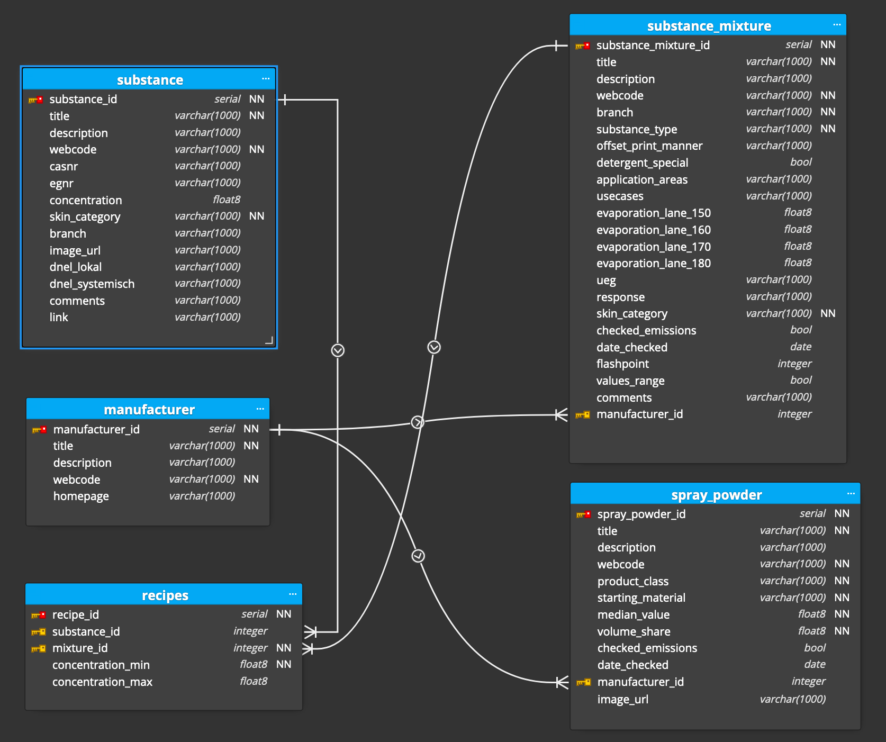
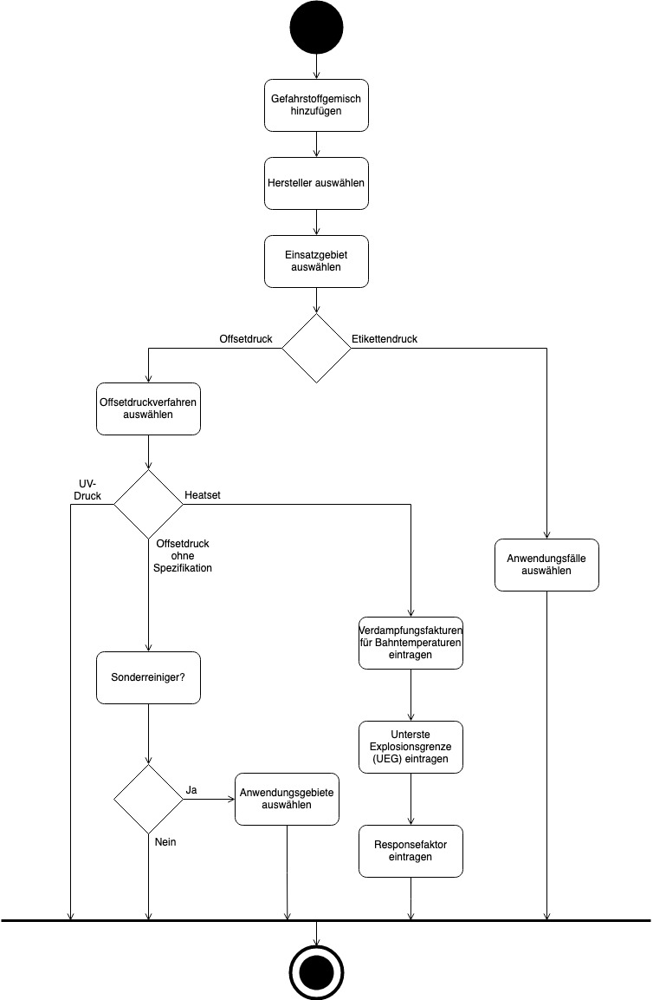
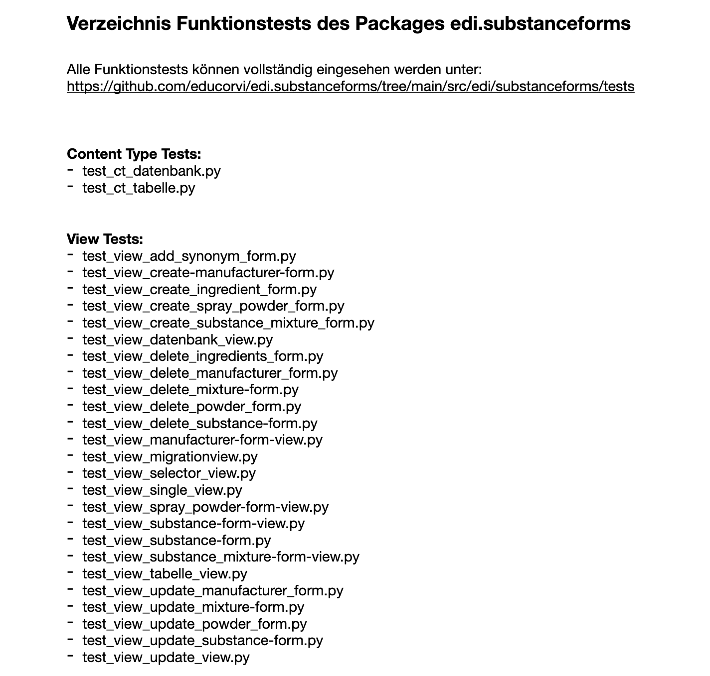
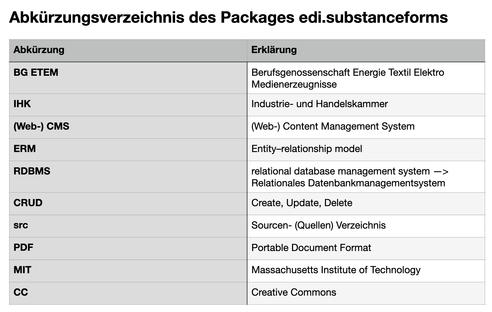

# Anhänge

## Anhang 1: Datenbankmodell

[Bild öffnen](https://doku.educorvi.de/wissensartikel/abbildungen-emissionsarme-produkte/datenbankmodell.png/image_view_fullscreen)

## Anhang 2: Aktivitätendiagramm Gefahrstoffgemisch anlegen

[Bild öffnen](https://doku.educorvi.de/wissensartikel/abbildungen-emissionsarme-produkte/aktivitatendiagramm.jpg/image_view_fullscreen)

## Anhang 3: Verzeichnis der Funktionstests

[Bild öffnen](https://doku.educorvi.de/wissensartikel/abbildungen-emissionsarme-produkte/funktionstests.png/image_view_fullscreen)

## Anhang 4: Abkürzungsverzeichnis 

[Bild öffnen](https://doku.educorvi.de/wissensartikel/abbildungen-emissionsarme-produkte/abkuerzungen.png/image_view_fullscreen)
