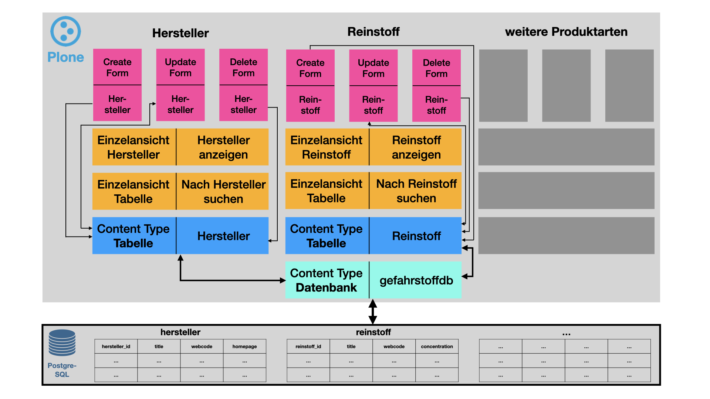

# Anwendungsarchitektur

## Blockschaubild der Anwendung
Hierbei handelt es sich um eine vereinfachte Darstellung des Zusammenspiels unterschiedlicher Komponenten des Projekts.

[Bild öffnen](https://doku.educorvi.de/wissensartikel/abbildungen-emissionsarme-produkte/blockdiagramm-001.jpeg/image_view_fullscreen)

## Ebenen der Anwendung
Die Anwendung besteht aus mehreren logischen Ebenen, die miteinander kommunizieren und Daten untereinander austauschen 
können. Im Folgenden wird das obige Bild, und damit die Funktionsweise von edi.substanceforms, von unten nach oben 
beschrieben.

### PostgreSQL

#### Relationales Datenbanksystem PostgreSQL
Die Basis der Architektur bildet ein relationales Datenbankmanagementsystem (RDBMS), basierend auf PostgreSQL. Da die 
Einrichtung dieser Datenbank nicht Teil des Projektes ist wird hier nur soweit darauf eingegangen um darzustellen, 
dass alle Daten zu Herstellern und Gefahrstoffprodukten hier gespeichert werden. Dafür kommt jeweils eine Tabelle 
zum Einsatz, die in ihren Spalten alle Eigenschaften der Produkte abbildet. Die Ausnahme bilden die Bilder zu den
Gefahrstoffprodukten. Diese werden direkt im CMS gespeichert. In der Datenbank wird ein URL-Referenz auf das Bild
gespeichert.

### Plone

Der genaue Aufbau der Software ist obiger Grafik zu entnehmen, der Entwurf der Klassendiagramme ist in [Anhang 6](anhang6.md) zu finden.

#### Content-Type Datenbank
Der Plone Content-Type (CT) Datenbank interagiert direkt mit der zugrunde liegenden PostgreSQL Datenbank. Da im CT 
Datenbank die Anmeldedaten der Datenbank hinterlegt werden, ist es das Modul, welches die Verbindung zur PostgreSQL-
Datenbank herstellt und für die Anwendung aufrecht erhält.

#### Content-Type Tabelle
Auf dem CT Datenbank sitzt der CT Tabelle. Für jede PostgreSQL-Datenbanktabelle die im CMS abgebildet werden soll 
wird ein CT Tabelle angelegt. Darin wird neben der referenzierten Datenbanktabelle auch spezifiziert, welche Spalten 
später bei der Einzelansicht berücksichtigt werden sollen. Für Gefahrstoffgemische gibt es die Möglichkeit, nur 
bestimmte Typen dieser Mixtur anzuzeigen.

#### Einzelansicht Tabelle
Die Standardansicht der Tabelle besitzt die Möglichkeit, alle Elemente der Tabelle (=Datensätze) anzuzeigen.
Diese Standardansicht wird im Programmcode für den Hersteller und die Gefahrstoffprodukte weiter spezialisiert werden.
Auf diese Weise wird der Benutzer in die Lage versetzt, die Datensätze nach entsprechenden Kriterien zu filtern. 
Diese Ansicht bildet eine Trefferliste, bei der die Benutzer auf einen Datensatz klicken können  um in die 
spezialisierte Einzelansicht des Herstellers oder Gefahrstoffproduktes zu kommen.

#### Einzelansicht Hersteller oder Produkt
Für jede Tabelle und die darin gespeicherten Datensätze gibt es spezialisierte Einzelansichten. In diesen 
Einzelansichten werden alle Eigenschaften der Hersteller oder Gefahrstoffprodukte, welche aus der PostgreSQL Datenbank 
abgerufen werden, visuell aufbereitet und angezeigt. Hierfür stehen der Einzelansicht unterschiedlichste Übersetzungs- 
und Umwandlungsmethoden der Klasse single_view zur Verfügung, welche von allen Einzelansichten gleichermaßen genutzt 
werden können.

#### Create-View
Der Create-View erlaubt es, der Datenbank einen neuen Datensatz hinzuzufügen. Er wird in der Ansicht der Tabelle 
über einen Button "Artikel hinzufügen" aufgerufen. Der Create-View ist ein HTML-Formular und beinhaltet Felder 
zu allen Attributen die erfasst werden können bzw. müssen. Die eingegebenen Eigenschaften werden nach mehrerer Prüfungen auf Plausibilität der Daten schließlich in die PSQL-Datenbank geschrieben.

#### Update-View
Der Update-View wird aus der Einzelansicht des Herstellers oder Produktes über einen Button "Artikel bearbeiten" 
aufgerufen. Der Update-View ist technisch wie optisch nahezu identisch mit dem Create-View, beinhaltet ebenfalls 
ein HTML-Formular mit allen Feldern, jedoch werden hier die Felder bereits vorbelegt mit den vorhandenen Daten. 
Soll eine Änderung vorgenommen werden, so ändert der Nutzer beispielsweise im Feld "Titel" den Inhalt von 
"Silux Max Super" zu "Silux Super Max".

#### Delete-View
Der Delete-View wird ebenfalls aus der Einzelansicht des Produktes aufgerufen, zum Einsatz kommt ein Button 
"Artikel löschen". Der Delete-View beinhaltet eine Abfrage, ob man sich sicher sei das Produkt löschen zu wollen. 
Wird das Kästchen entsprechend angekreuzt so wird der Datensatz aus der Datenbanktabelle von PostgreSQL entfernt.

*[CT]: Content-Type (Artikeltyp)
